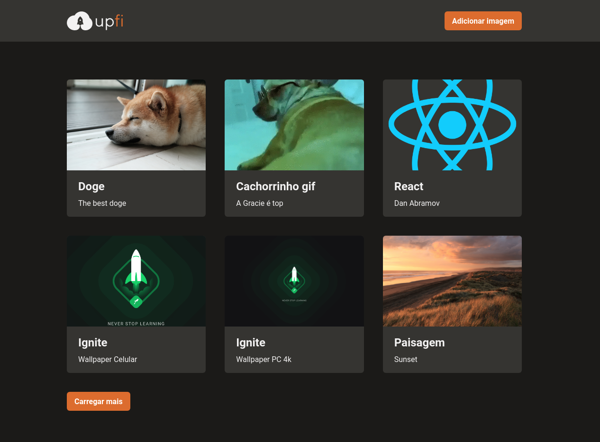
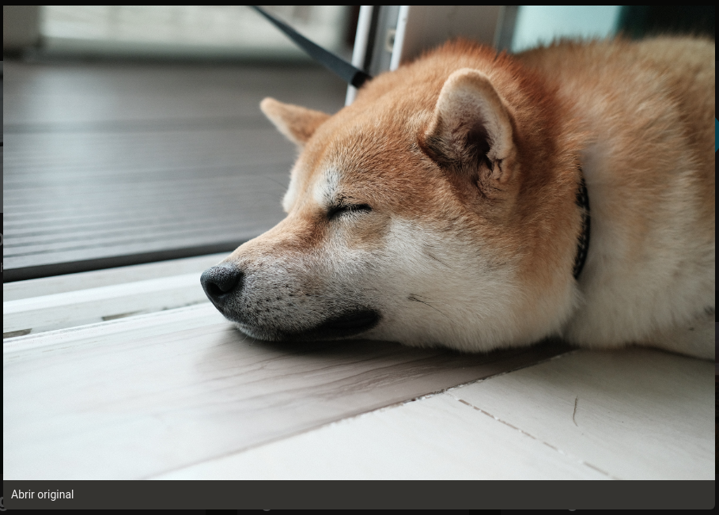
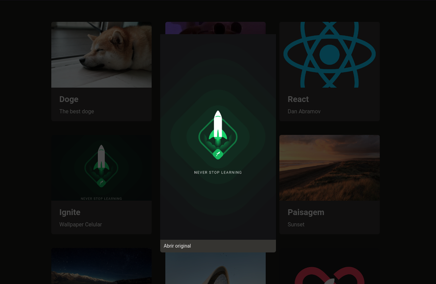
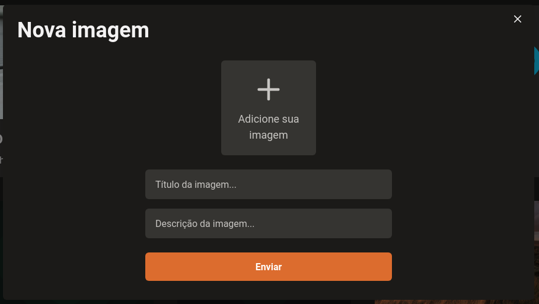

<h3 align="center">
  Desafio 02: Upload de imagens
</h3>

<blockquote align="center">“Só deseje as coisas as quais você está disposto a lutar”!</blockquote>

<p align="center">
  

  <a href="https://rocketseat.com.br">
    
  </a>

  

  <a href="https://github.com/Rocketseat/bootcamp-gostack-desafios/stargazers">
    
  </a>
</p>

<p align="center">
  <a href="#rocket-sobre-o-desafio">Sobre o desafio</a>&nbsp;&nbsp;&nbsp;|&nbsp;&nbsp;&nbsp;
  <a href="#calendar-entrega">Entrega</a>&nbsp;&nbsp;&nbsp;|&nbsp;&nbsp;&nbsp;
  <a href="#memo-licença">Licença</a>
</p>

## :rocket: Sobre o desafio

Nesse desafio, você deverá criar uma aplicação para treinar o que aprendeu até agora no ReactJS

Essa será uma aplicação onde o seu principal objetivo é adicionar alguns trechos de código para que a aplicação de upload de imagens funcione corretamente. Você vai receber uma aplicação com muitas funcionalidades e estilizações já implementadas. Ela deve realizar requisições para sua própria API Next.js que vai retornar os dados do FaunaDB (banco de dados) e do ImgBB (serviço de hospedagem de imagens). A interface implementada deve seguir o layout do Figma. Você terá acesso a 4 arquivos para implementar:

- Infinite Queries e Mutations com React Query;
- Envio de formulário com React Hook Form;
- Exibição de Modal e Toast com Chakra UI;
- Entre outros.

A seguir veremos com mais detalhes o que e como precisa ser feito 🚀

### Template da aplicação

Para te ajudar nesse desafio, criamos para você um modelo que você deve utilizar como um template do Github.

O template está disponível na seguinte url: **[Acessar Template](https://github.com/rocketseat-education/ignite-template-reactjs-upload-de-imagens)**

**Dica**: Caso não saiba utilizar repositórios do Github como template, temos um guia em **[nosso FAQ](https://github.com/Rocketseat/bootcamp-gostack-desafios/tree/master/faq-desafios).**

Agora navegue até a pasta criada e abra no Visual Studio Code, lembre-se de executar o comando `yarn` no seu terminal para instalar todas as dependências.
### Se preparando para o desafio

Para esse desafio, iremos reforçar alguns pontos e apresentar algumas libs para te ajudar no desenvolvimento.

Começando pelo tema do projeto: upload de imagens. Como o desenvolvimento do zero acarretaria em um projeto muito grande, fornecemos no template a maior parte do projeto já implementada para que você tenha que trabalhar apenas com 4 arquivos. A ideia é que nesses 4 arquivos você tenha um pouco de contato com os 3 principais pontos que queremos abordar nesse projeto: React Query, React Hook Form e Chakra UI.

Dessa forma, antes de ir diretamente para o código do desafio, explicaremos brevemente como cada um dos pontos abaixo são importantes para o desafio:

- React Query;
- React Hook Form;
- ImgBB;
- FaunaDB;
- API do Next.js;
- Figma.

Vamos nessa?

## React Query

Na aplicação do desafio, você vai lidar com Infinite Queries, Mutations e Invalidações. Ao longo da seção **[O que devo editar na aplicação](https://www.notion.so/Desafio-02-Upload-de-imagens-4cf1c3b1c1ad4a66961b6e48558cc3b8)** iremos mencionar quando cada uma dessas funcionalidades será utilizada, mas já vamos entender um pouquinho o papel de cada uma delas na nossa aplicação:

- **Infinite Queries**: Listagem que adiciona mais dados ao clicar em um botão de carregamento ou "infinite scroll". Ela será utilizada nessa aplicação para realizar o carregamento das imagens cadastradas no nosso banco. O carregamento foi implementado com um clique em um botão, não o "infinite scroll" (já fica aí a sugestão de um extra para o desafio).
- **Mutations**: Diferente das queries do React Query que são utilizadas normalmente para a busca de dados, as mutations são responsáveis pela criação/edição/remoção de dados. Ela será utilizada nessa aplicação para o cadastro de uma nova imagem no banco.
- **Invalidações**: Utilizada para marcar manualmente uma query como `stale` e forçar a atualização dos dados. Ela será utilizada nessa aplicação para marcar a query de listagem de imagens como `stale` quando a mutation de cadastrar uma nova imagem ocorrer com sucesso.

Caso queira se aprofundar nesse assunto, deixaremos aqui alguns links que podem te ajudar

[Infinite Queries](https://react-query.tanstack.com/guides/infinite-queries)

[Mutations](https://react-query.tanstack.com/guides/mutations)

[Invalidation from Mutations](https://react-query.tanstack.com/guides/invalidations-from-mutations)

## React Hook Form

Na aplicação do desafio, você vai precisar implementar o registro dos inputs do formulário de cadastro da imagem, as validações e enviar os erros desses inputs.

Diferentemente do que foi visto na jornada, dessa vez você deve trabalhar com as validações diretamente no React Hook Form em vez de utilizar um `resolver` do Yup.

Caso queira se aprofundar nesse assunto, deixaremos aqui um link que pode te ajudar:

[useForm - register](https://react-hook-form.com/api/useform/register)
## ImgBB

Para o armazenamento das imagens do desafio, decidimos utilizar uma solução de hospedagem de arquivos gratuita e de fácil utilização chamada ImgBB. Não é a melhor solução para esse tipo de hospedagem, mas é a mais fácil pra vocês conseguirem implementar.

Portanto, para conseguir realizar os uploads das imagens para essa plataforma você precisar seguir 3 passos:

1. [Criar uma conta](https://imgbb.com/login) no ImgBB;
2. [Criar a sua chave](https://api.imgbb.com/) da API;
3. Copiar o valor dessa chave e colar no seu `.env.local` da seguinte forma:

`NEXT_PUBLIC_IMGBB_API_KEY=VALOR_DA_CHAVE_COPIADA`

Com esses três passos, você deve conseguir realizar o upload dessas imagens para o ImgBB normalmente. Caso tenha dúvidas, dê uma olhada no link abaixo:

[Upload Image - Free Image Hosting](https://api.imgbb.com/)

## FaunaDB

Para o armazenamento das informações das imagens (url, título e descrição), decidimos utilizar o FaunaDB já utilizado por você ao longo da jornada. Tudo que você precisa fazer é criar um banco no FaunaDB com um nome de sua preferência que **precisa** ter uma coleção chamada `images`. Com o banco e coleção criados, basta você criar e copiar a chave do banco no seu arquivo `.env.local` da seguinte forma:

`FAUNA_API_KEY=VALOR_DA_CHAVE_COPIADA`

Dessa forma você deve conseguir realizar o cadastro das informações das imagens no FaunaDB. Caso tenha dúvidas, reassista as aulas sobre a configuração do FaunaDB ou dê uma olhada no link abaixo:

[Welcome to the Fauna documentation!](https://docs.fauna.com/fauna/current/start/index.html)

## API do Next.js

Nesse desafio toda a API do Next.js já foi implementada para você, porém vamos explicar rapidamente o que foi feito nessa etapa para que você entenda os dados que deve enviar e os dados que irá receber ao realizar as requisições.

- **GET api/images**: Essa é a rota utilizada para listagem das imagens. Ela rota recebe um `query param` de nome `after` que indica caso haja mais dados a serem carregados do FaunaDB. Por padrão, foi definido que a paginação da resposta do FaunaDB é de 6 dados. A resposta da API é um `json` com dois valores:
    - **data**: Dados formatados das imagens cadastradas no FaunaDB, exemplo:

        ```jsx
        "data": [
        	{
        	  "title": "Doge",
            "description": "The best doge",
            "url": "https://i.ibb.co/K6DZdXc/minh-pham-LTQMgx8t-Yq-M-unsplash.jpg",
            "ts": 1620222828340000,
            "id": "294961059684418048"
        	},
        ]
        ```

    - **after**: Referência da próxima página de dados caso tenham mais imagens a serem carregadas do FaunaDB. Caso contrário, retorna `null`.
- **POST api/images**: Essa é a rota utilizada para cadastro das informações da imagem (url, título e descrição) no FaunaDB. Tudo que você precisa enviar são esses três dados pelo `body` que o cadastro irá ocorrer e, caso dê tudo certo, retornará uma mensagem `success: true`.

## Figma

Como a maior parte do layout do figma já foi implementada, o seu foco nesse desafio deve ser implementar o grid da listagem de imagens e o Modal ao clicar na imagem desejada.

### Acessando o layout do app

Para duplicar os layouts, basta você clicar no link abaixo. Ele adicionará o Layout à sua dashboard do Figma automaticamente, como uma cópia.

[Desafio 2 Módulo 4 ReactJS](https://www.figma.com/file/QKxbxCVwwlDLMrCtHae239/Desafio-2-M%C3%B3dulo-4-ReactJS/duplicate)

# O que devo editar na aplicação?

Com o template já clonado, as depêndencias instaladas e o Prismic já configurado, você deve completar onde não possui código com o código para atingir os objetivos de cada teste. Os documentos que devem ser editados são:

- [src/pages/index.tsx](https://github.com/rocketseat-education/ignite-template-reactjs-upload-de-imagens/blob/master/src/pages/index.tsx);
- [src/components/Form/FormAddImage.tsx](https://github.com/rocketseat-education/ignite-template-reactjs-upload-de-imagens/blob/master/src/components/Form/FormAddImage.tsx);
- [src/components/Modal/ViewImage.tsx](https://github.com/rocketseat-education/ignite-template-reactjs-upload-de-imagens/blob/master/src/components/Modal/ViewImage.tsx);
- [src/components/CardList.tsx](https://github.com/rocketseat-education/ignite-template-reactjs-upload-de-imagens/blob/master/src/components/CardList.tsx).

### pages/index.tsx



Esse arquivo, por ser a única página do seu app, é o responsável direto ou indireto pela renderização de toda a sua aplicação.

A primeira coisa a se fazer é utilizar corretamente a Infinite Query. Portanto, no `useInfiniteQuery` você precisa montar duas seções principais:

1. Uma função que recebe como parâmetro um objeto que contêm a propriedade `pageParam` (caso o parâmetro não exista, utilize como `default` o valor `null`). Esse parâmetro é utilizado no momento da requisição para chamarmos uma próxima página.
Já no corpo da função, você deve realizar uma requisição GET para a rota `/api/images` da API do Next.js informando como um `query param` de nome `after` o valor do `pageParam` e retornar os dados recebidos.
2. Uma função chamada `getNextPageParam` que recebe como parâmetro o resultado da última requisição. Se o valor `after` retornado na última requisição existir, então você deve retornar esse valor, caso contrário retorne `null`.

Caso você esteja com dificuldades de entender como trabalhar com o `useInfiniteQuery`, dê uma olhada [nesse trecho da doc oficial](https://react-query.tanstack.com/guides/infinite-queries)

Outro passo importante a se fazer é formatar os dados recebidos do React Query da forma que a aplicação espera. Portanto, no `formattedData` é preciso que você utilize o `map` e o `flat` para que você transforme o `data` (um objeto com mais informações do que o seu `CardList.tsx` precisa) em um array de objetos apenas com as informações necessárias. Abaixo segue um exemplo de como fica antes e após a conversão.

```jsx
{
    "pages": [
        {
            "data": [
                {
                    "title": "Doge",
                    "description": "The best doge",
                    "url": "https://i.ibb.co/K6DZdXc/minh-pham-LTQMgx8t-Yq-M-unsplash.jpg",
                    "ts": 1620222828340000,
                    "id": "294961059684418048"
                },
                {
                    "title": "Cachorrinho gif",
                    "description": "A Gracie é top",
                    "url": "https://i.ibb.co/r3NbmgH/ezgif-3-54a30c130cef.gif",
                    "ts": 1620222856980000,
                    "id": "295991055792210435"
                },
                {
                    "title": "React",
                    "description": "Dan Abramov",
                    "url": "https://i.ibb.co/864qfG3/react.png",
                    "ts": 1620223108460000,
                    "id": "295991069654385154"
                },
                {
                    "title": "Ignite",
                    "description": "Wallpaper Celular",
                    "url": "https://i.ibb.co/DbfGQW5/1080x1920.png",
                    "ts": 1620223119610000,
                    "id": "295991085899973123"
                },
                {
                    "title": "Ignite",
                    "description": "Wallpaper PC 4k",
                    "url": "https://i.ibb.co/fvYLKFn/3840x2160.png",
                    "ts": 1620223133800000,
                    "id": "295991107279389188"
                },
                {
                    "title": "Paisagem",
                    "description": "Sunset",
                    "url": "https://i.ibb.co/st42sNz/petr-vysohlid-9fqw-Gq-GLUxc-unsplash.jpg",
                    "ts": 1620223149390000,
                    "id": "295991128736399874"
                }
            ],
            "after": "295991160078336512"
        }
    ],
    "pageParams": [
        null
    ]
}
```

```jsx
[
    {
        "title": "Doge",
        "description": "The best doge",
        "url": "https://i.ibb.co/K6DZdXc/minh-pham-LTQMgx8t-Yq-M-unsplash.jpg",
        "ts": 1620222828340000,
        "id": "294961059684418048"
    },
    {
        "title": "Cachorrinho gif",
        "description": "A Gracie é top",
        "url": "https://i.ibb.co/r3NbmgH/ezgif-3-54a30c130cef.gif",
        "ts": 1620222856980000,
        "id": "295991055792210435"
    },
    {
        "title": "React",
        "description": "Dan Abramov",
        "url": "https://i.ibb.co/864qfG3/react.png",
        "ts": 1620223108460000,
        "id": "295991069654385154"
    },
    {
        "title": "Ignite",
        "description": "Wallpaper Celular",
        "url": "https://i.ibb.co/DbfGQW5/1080x1920.png",
        "ts": 1620223119610000,
        "id": "295991085899973123"
    },
    {
        "title": "Ignite",
        "description": "Wallpaper PC 4k",
        "url": "https://i.ibb.co/fvYLKFn/3840x2160.png",
        "ts": 1620223133800000,
        "id": "295991107279389188"
    },
    {
        "title": "Paisagem",
        "description": "Sunset",
        "url": "https://i.ibb.co/st42sNz/petr-vysohlid-9fqw-Gq-GLUxc-unsplash.jpg",
        "ts": 1620223149390000,
        "id": "295991128736399874"
    }
]
```

Em seguida, com a Infinite Query configurada e os dados formatados, você deve focar na renderização do seu app. Serão três renderizações diferentes:

1. **Quando o React Query estiver carregando os dados**: Nesse caso você deve utilizar o `isLoading` para ajudar a renderizar o componente `Loading.tsx` no momento adequado.
2. **Quando o React Query tiver falhado ao carregar os dados**: Nesse caso você deve utilizar o `isError` para ajudar a renderizar o componente `Error.tsx` no momento adequado.
3. **Quando o React Query tiver carregado os dados com sucesso**: Nesse caso, quando o app não cair em uma das duas renderizações anteriores, será considerado a renderização de sucesso. No caso desse app, é o `return` que já deixamos parcialmente montado para você e que explicaremos com mais detalhes abaixo o que falta ser implementado.

No caso dos dados terem sido carregados com sucesso, você deve renderizar o Header da aplicação e as imagens cadastradas no FaunaDB, mas não todas de uma vez.

Serão exibidos 6 cards por vez, caso tenha mais imagens para serem carregadas, um botão escrito `Carregar mais` deve ser exibido. Caso contrário, o botão não deve ser renderizado. Além disso, ao clicar no botão `Carregar mais` é preciso que ele altere a mensagem do texto para `Carregando...` enquanto o React Query realiza a busca dos novos dados. Para que essas funcionalidades do botão deem certo, utilize o `hasNextPage`, `isFetchingNextPage` e `fetchNextPage` do React Query.

Caso você esteja com dificuldades de entender como trabalhar com o `hasNextPage`, `isFetchingNextPage` e `fetchNextPage`, dê uma olhada [nesse trecho da doc oficial](https://react-query.tanstack.com/guides/infinite-queries)

### components/CardList.tsx


Esse arquivo é responsável pela exibição do grid de cards e o controle do Modal de exibição da imagem selecionada.

Os cards devem ser renderizados em um grid de 3 colunas com um espaçamento de 40px. Utilize o componente `Card.tsx` para a renderização dos cards.

Ao clicar no card, é preciso abrir a modal `ViewImage.tsx`. Utilize a prop `viewImage` do `Card.tsx` para disparar uma função, que recebe como argumento a url da imagem, e irá lidar com a abertura do Modal `ViewImage.tsx` e o envio da url da imagem desejada.

### components/Modal/ViewImage.tsx



Nesse modal serão exibidos uma imagem e o link.

Essa imagem deve ter como largura máxima `900px` e como altura máxima `600px`, mantendo a proporção da imagem dependendo de qual dessas duas medidas chegar no valor máximo primeiro.

Por exemplo, um wallpaper de celular tem a altura muito maior que a largura, já um wallpaper de um monitor widescreen tem a largura muito maior que a altura. Portanto, um exemplo prático desse dois casos seria os prints abaixo:



Wallpaper celular (limitou pela altura max de 600px)


Wallpaper pc (limitou pela largura max de 900px)

Em relação ao link, ele deve ser renderizado abaixo da imagem com o texto `Abrir original` que aponta para o endereço onde a imagem está hospedada no ImgBB. Ao clicar no link, ele deve abrir uma nova aba no navegador

### components/Form/FormAddImage.tsx



Nesse arquivo, você tem quatro etapas principais que precisa implementar:

1. As validações do formulário;
2. A `mutation` do React Query;
3. A função `onSubmit`;
4. O registro dos inputs no React Hook Form.

Começando pelas validações, você encontrará um objeto `formValidations` com as propriedades `image`, `title` e `description`. Essas propriedades representam cada um dos três inputs do formulário e é dentro delas que você irá declarar as validações desses inputs. As validações são:

- image:
    - **required**: Campo obrigatório, não pode estar vazio no momento do envio. A mensagem de erro deve ser `Arquivo obrigatório`
    - **validate**: Como as outras duas validações são customizadas, ou seja, não tem por padrão no React Hook Form, iremos criá-las manualmente com o `validate`.

        Caso tenha dúvidas de como trabalhar com essa propriedade, dê uma olhada [nesse trecho da doc oficial](https://react-hook-form.com/api/useform/register)

        - **lessThan10MB**: O tamanho do arquivo não pode exceder 10 MB. Utilize a propriedade `size` do arquivo de imagem para realizar a comparação. A mensagem de erro deve ser `O arquivo deve ser menor que 10MB`.
        - **acceptedFormats**: O arquivo enviado pelo usuário deve ser um dos três tipos: image/jpeg, image/png ou image/gif. Utilize a propriedade `type` do arquivo de imagem e um `regex` com os tipos aceitos para realizar a comparação. A mensagem de erro deve ser `Somente são aceitos arquivos PNG, JPEG e GIF`.
- title:
    - **required**: Campo obrigatório, não pode estar vazio no momento do envio. A mensagem de erro deve ser `Título obrigatório`
    - **minLength**: O tamanho mínimo da string deve ser de 2 caracteres. A mensagem de erro deve ser `Mínimo de 2 caracteres`.
    - **maxLength**: O tamanho máximo da string deve ser de 20 caracteres. A mensagem de erro deve ser `Máximo de 20 caracteres`.
- description:
    - **required**: Campo obrigatório, não pode estar vazio no momento do envio. A mensagem de erro deve ser `Descrição obrigatória`
    - **maxLength**: O tamanho máximo da string deve ser de 65 caracteres. A mensagem de erro deve ser `Máximo de 65 caracteres`.

Agora que você possui as validações criadas, é hora de registrar os seus inputs no React Hook Form. Portanto, em cada um dos seus três inputs, é preciso que você envie

- Uma propriedade `register` que possui o nome do seu input como o primeiro parâmetro e a validação desse input como segundo parâmetro.
- Uma propriedade `error` na qual você deve mandar o erro referente ao seu input. Utilize o `errors` obtido na desestruturação do `formState`.

Outro etapa que precisa ser implementada nesse arquivo é a `mutation` do React Query. Essa `mutation` será responsável pelo cadastro da nova imagem no FaunaDB. Portanto, como primeiro argumento do `useMutation`, você deve implementar uma função que recebe como parâmetro os dados do formulário e no seu corpo realizar uma requisição POST para a rota `api/images` enviando os dados recebidos.
Já como segundo parâmetro, você irá utilizar a propriedade `onSuccess` da `mutation` para que, caso ela ocorra com sucesso, invalidade a `query` que listou as imagens, forçando o React Query a atualizar esses dados. Para isso, trabalhe com o método `invalidateQueries`.

Caso tenha dúvidas de como trabalhar com essa propriedade, dê uma olhada [nesse trecho](https://react-query.tanstack.com/guides/mutations) e [também nesse trecho](https://react-query.tanstack.com/guides/invalidations-from-mutations) da doc oficial

Por fim, é preciso implementar a função `onSubmit`. Essa função recebe como argumento os dados do formulário de cadastro da imagem. No corpo da função, você encontrará três seções:

- **try**: Nesse trecho você deve se concentrar em três etapas:
    - Verificar se o `imageUrl` existe. Se não existir, mostrar um `toast` de informação com o título `Imagem não adicionada` e descrição `É preciso adicionar e aguardar o upload de uma imagem antes de realizar o cadastro.` e sair imediatamente da função. Caso exista, basta seguir para as próximas etapas.
    - Executar a `mutation` utilizando o `mutateAsync` para pode aguardar o resultado da Promisse.
    - Mostrar um `toast` de sucesso com o título `Imagem cadastrada` e descrição `Sua imagem foi cadastrada com sucesso.`
- **catch**: Nesse trecho você deve mostrar um `toast` de erro com o título `Falha no cadastro` e descrição `Ocorreu um erro ao tentar cadastrar a sua imagem.`
- **finally**: Nesse trecho você deve limpar os campos do form, os estados do componente e fechar o modal.

# Especificação dos testes

Em cada teste, você encontrará uma breve descrição do que sua aplicação deve cumprir para que o teste passe.

Caso você tenha dúvidas quanto ao que são os testes, e como interpretá-los, dê uma olhada em **[nosso FAQ](https://www.notion.so/FAQ-Desafios-ddd8fcdf2339436a816a0d9e45767664)**

Para esse desafio, temos os seguintes testes:

[Testes pages/Home.spec.tsx](.github/hometests.md)

# 📅 Entrega

Esse desafio deve ser entregue a partir da plataforma da Rocketseat. Envie o link do repositório que você fez suas alterações. Após concluir o desafio, além de ter mandado o código para o GitHub, fazer um post no LinkedIn é uma boa forma de demonstrar seus conhecimentos e esforços para evoluir na sua carreira para oportunidades futuras.

## :memo: Licença

Esse projeto está sob a licença MIT. Veja o arquivo [LICENSE](LICENSE) para mais detalhes.

---

Feito com 💜 by Rocketseat :wave: [Entre na nossa comunidade!](https://discordapp.com/invite/gCRAFhc)
